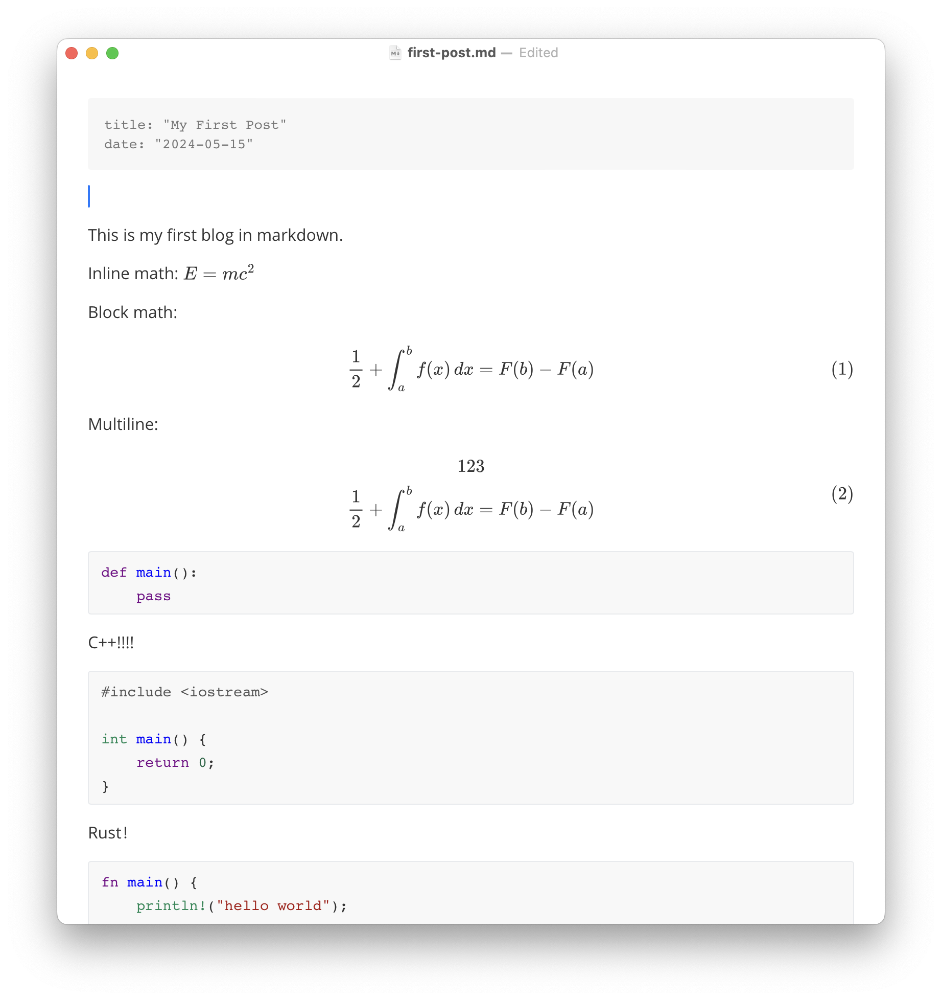

This is my first blog in markdown as an example and testcase.

Inline math: $E = mc^2$ [^2]

[^2]: This is also a footnote

Block math[^1]:
$$
\int_{a}^{b} f(x) \,dx = F(b) - F(a)
$$

Multiline:
$$
123 \\
\int_{a}^{b} f(x) \,dx = F(b) - F(a)
$$

[^1]: This is a footnote.

```python
def main():
    pass
```

C++!!!!

```cpp
#include <iostream>

int main() {
    return 0;
}
```

Rust！

```rust
fn main() {
    println!("hello world");
}
```

Mermaid?


Not yet.

### Header 3

1111

---

Not bad
